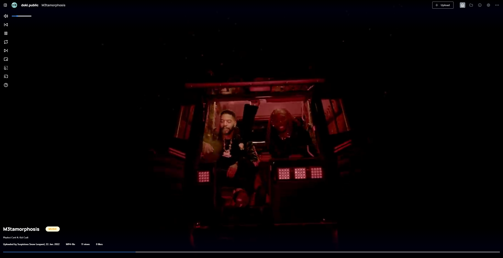

# doki

This is the official repository for the doki project.

A social file hosting for you and your friends, powered by a custom Express/NextJS MySQL-driven stack where the frontend and backend are driven by TypeScript.

### Changes from the original branch

The new M2 branch has a rewritten foundation in TypeScript for the project going further. This allows us to integrate backend and frontend much easier than previously, which is also contributed by the move over to NextJS. 

### Bootstrapping

Currently there is no easy setup to create your own instance, the manual procedure (so far) is the following:

- Get NodeJS LTS, ffmpeg, yt-dlp and a fitting MySQL instance.
- The MySQL instance must contain compatible tables, this includes `Files`, `Author`, `Comments` and `Space` tables with their own special properties (more on this later).
- Change the database variables and add your own space secret in `.env` to the MySQL instance.
- `yarn`
- Then execute `export NODE_ENV="production" && yarn build && yarn start`.

A docker image will be provided later which streamlines the entire bootstrap process.

This section will be updated as development continues.

### Acknowledgements
Backend - Custom NodeJS server written with TypeScript, uses Express and NextJS.

Frontend - NextJS-driven React with Mantine as main UI component library.

Both ends share the same Sequelize models used to communicate with a MySQL database.

ffmpeg is used to generate thumbnails of video uploads. yt-dlp is used for the Youtube importing feature, which should only be used if you own the video. (can be removed at any time)

